footer: Patrick Rauland - @BFTrick

## Are Robots Coming to Take Your Job?

---

# Software Developer

^ I'm a software developer and I program a lot of boring things so that people don't have to do them any more.

^ And I view automation as a mixed bag with some good stuff and some bad stuff.

^ But when I hear about automation on a podcast, on a blog, or in the news it gets a pretty bad rap.

---

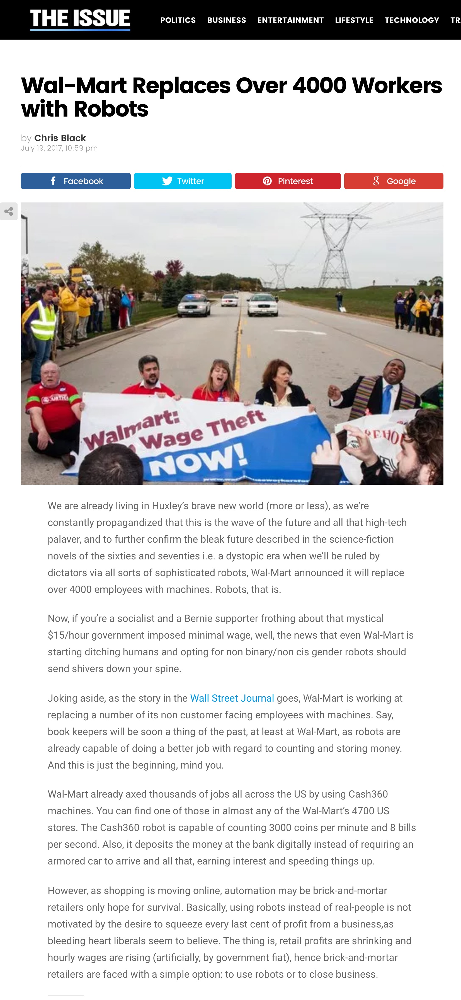

Walmart replaces 4,000 workers with robots.[^1]

[^1]: https://www.theissue.com/politics/wal-mart-replaces-over-4000-workers-with-robots

^ Just last month Walmart replaced 4,000 workers with robots.

---

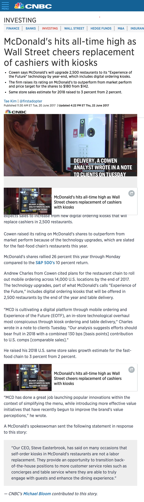

McDonalds replaces cashiers with kiosks in 2,500 restaurants[^2]

^ In June McDonalds replaced cashiers with kiosks in 2,500 restaurants. They look just like the airport kiosks.

[^2]: https://www.cnbc.com/2017/06/20/mcdonalds-hits-all-time-high-as-wall-street-cheers-replacement-of-cashiers-with-kiosks.html

---

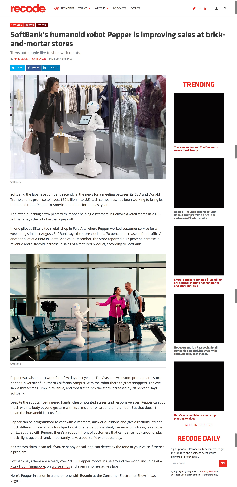

Pepper helps retail stores.[^3]

^ This is Pepper. It's a humanoid robot that's been in a few pilot stores in San Francisco.

^ And the main purpose is to help people find things in store.

^  One store saw a 13% increase in revenue
^  Another saw a 6X increase in sales in their featured product.

[^3]: https://www.recode.net/2017/1/4/14171436/softbank-robot-pepper-sales-brick-and-mortar-retail-ces

^ To be fair when I go into best buy the last thing I want to do is talk to one of the sales representatives. I usually try to sneak in with out any of them asking me if I need any help. If I need help I'm surrounded by people in blue shirts. I'll be fine.

^ So maybe the robots are just less annoying?

^ Either way not having to pay employees hourly and seeing increases in revenue you can expect these to start showing up in the stores you visit.

^ Can read facial expressions so it knows if you're happy or sad.

^ It also can tell from the tone of your voice what emotional state you're in.

---

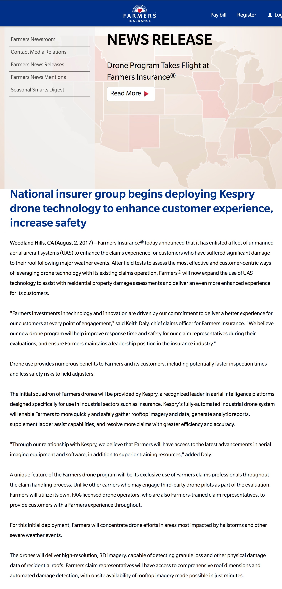

Farmer's Insurance dispatch drones for insurance claims[^4]

[^4]: https://www.farmers.com/news/2017/drone-program-takes-flight-at-farmers-insurance/

^ Farmer's Insurance announced two weeks ago that they're starting to dispatch drones to resolve any hail damage claims to your roof. And they said they're going to start in areas that have a lot of hail damange. So the next time you have hail damage to your roof and you submit a claim you may have a drone stop by instead of a human.

---

^ And this bot took my dream job away. T-rex pancake maker.

^ This is called PancakeBot. And you can get it on Amazon for $300. It prints anything you draw.

---

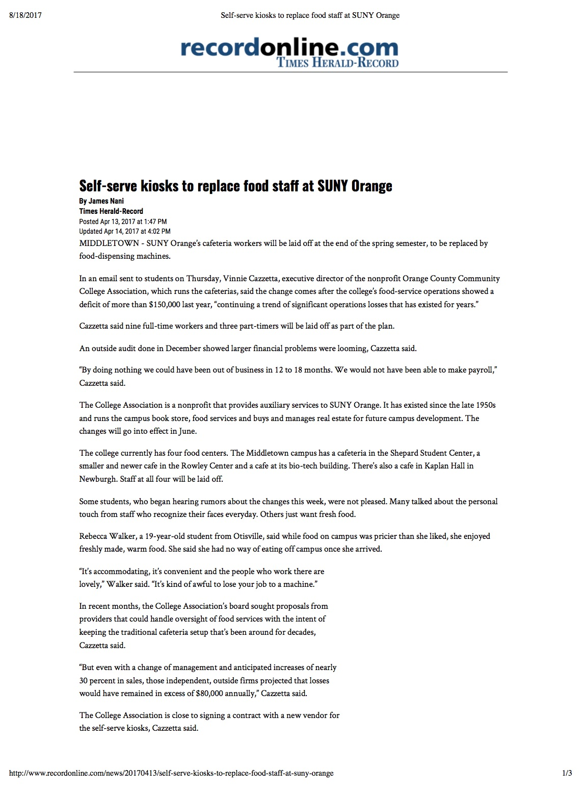

This cafeteria replaced all of their staff with self serve vending Machines[^5]

[^5]: http://www.recordonline.com/news/20170413/self-serve-kiosks-to-replace-food-staff-at-suny-orange

^ I feel so bad for the kids at that school.

---

^ And even academic literature paints a bleak future But a lot of them reference this study:

> According to our estimates, about 47 percent of total US employment is at risk. [^6]

[^6]: http://www.oxfordmartin.ox.ac.uk/downloads/academic/The_Future_of_Employment.pdf

^ this is one of the most cited studies which basically says you're fucked. Well 47% of us.

---

^ When you look at these headlines and you look at some of these academic studies the only logical conclusion is:

^ The robots are going to take our jobs and we're all going to die.

^ But I think when it comes to the academic studies there's an assumption.

---

### Assumption:

## If a job _can_ be automated it _will_

^ But I don't think this is true. Even though we have been automating jobs since computers became mainstream in the 80s we haven't really seen that would indicate that their are net job losses.

---

## Is There Evidence Robots Are Taking Our Jobs?

^ We've seen articles like the ones I showed earlier for the past couple years.

^ Before we start losing our minds that a bazillion jobs have been lost and we're all going to starve in the gutter let's take a look at what's happened so far.

^ There are a couple numbers we can look at. The fist is productivity which is tracked by the US Labor Department.

^ And productivity is basically the total amount of good and services divided by the total amount of hours worked

^ So as robots do more work we should see an increase in productivity

---

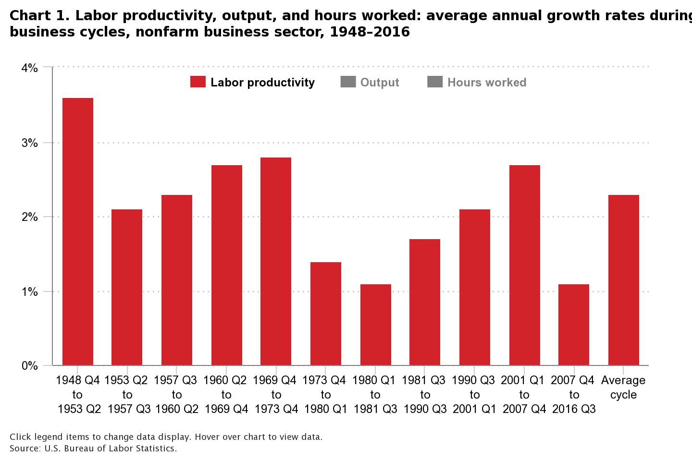

^ But actually the opposite has happened.

^ In the 1940s-1970s we were on average 3% more productive every year.

^ But since 2007 it's grown at a rate of 1.2 percent.

^ And the last two years it's been 0.6 percent.

^ https://www.wired.com/2017/08/robots-will-not-take-your-job/

^ So productivity is insanely low. We should be seeing really high productivity because robots are doing jobs for us.

---

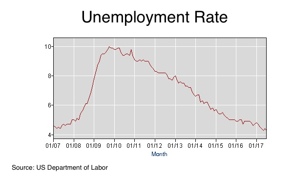

^ Also you'd think if automation were happening on a grand scale we'd see a spike in unemployment. But we're below 5% which is healthy.

^ And we're basically back to where we were since 2007 before the recession.

^ from: https://data.bls.gov/pdq/SurveyOutputServlet

---

^ Or maybe you'd say that unemployment might not be low if people quickly find another job. But if you look at job churn it's the lowest it's been in decades

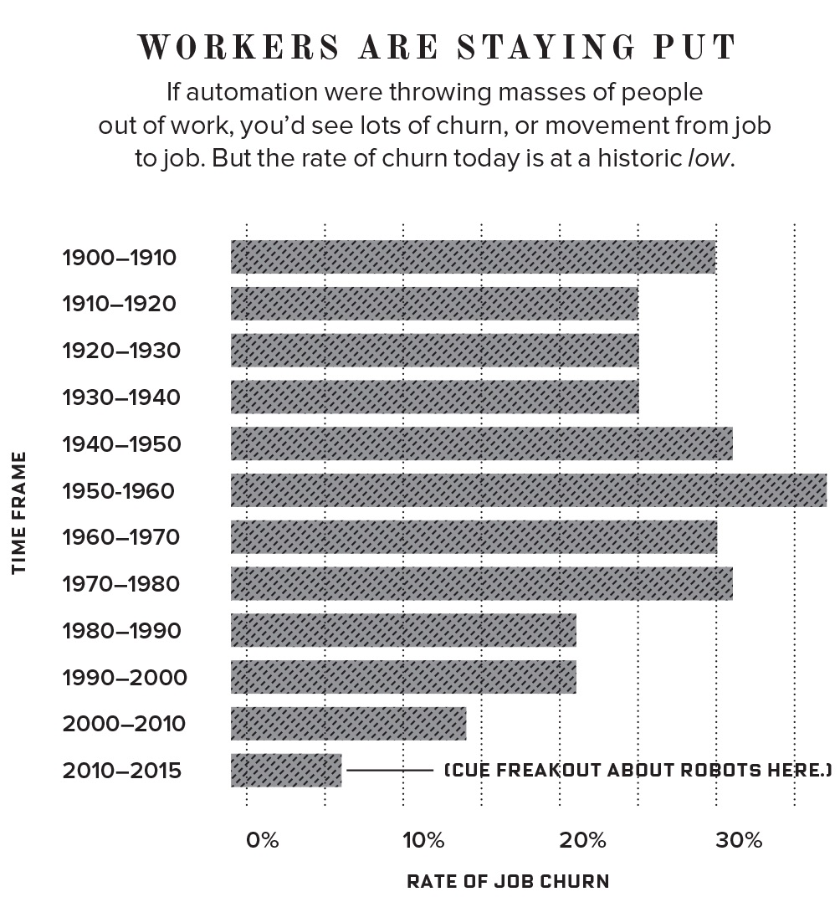

^ from: https://www.wired.com/2017/08/robots-will-not-take-your-job/

^ this means that people aren't moving from job to job. Or industry to industry and they're being disrupted.

---

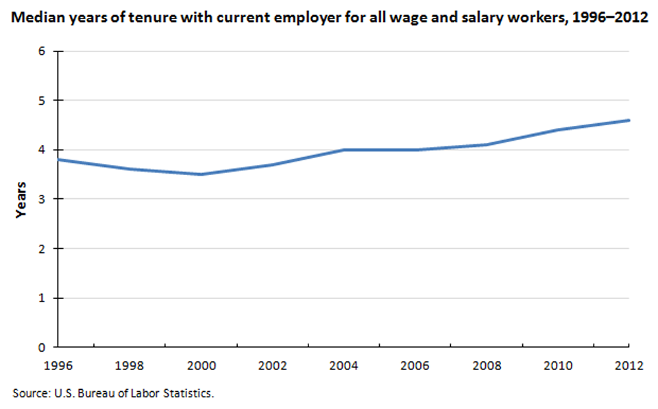

^ and if you look at other metrics like job tenure they match up. Job tenure is going up meaning people are working longer at the same company than they were 5-10 years ago.

---

## No Evidence Automation Is Ruining Employment

^ So even though we've been automating jobs with computers for the last 5 decades it hasn't had much of an affect on jobs.

---

## Why Automation Isn't Taking Off

^ I'd like to take some time to explain why it isn't working. Because again it seems so obvious that it is going to explode our economy.

---

## 1) No Investment

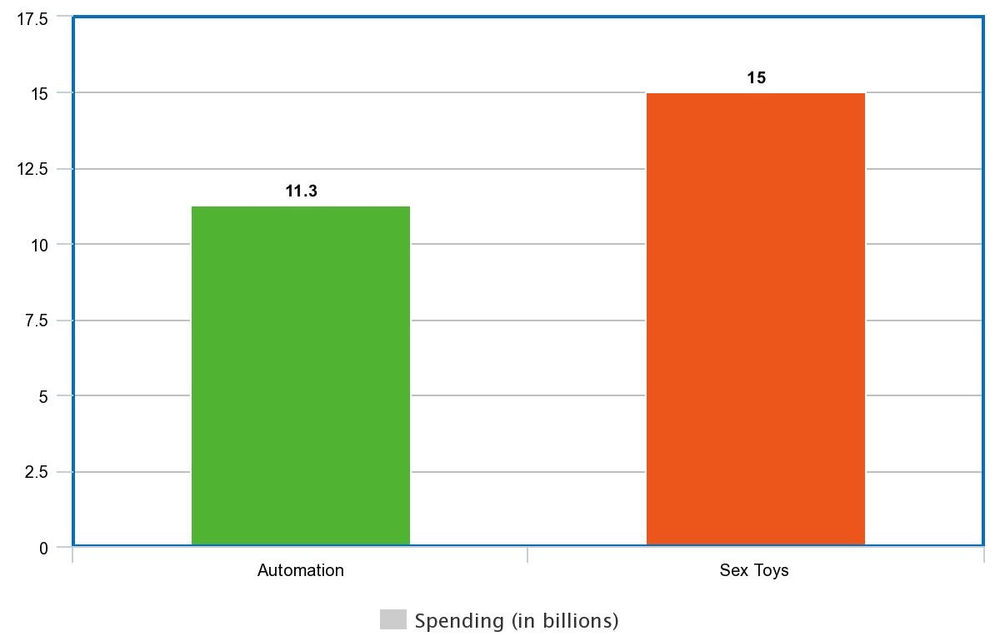

^ One reason we aren't moving faster towards robotics is that we aren't spending any money on it.

^ that small bar is what we invested in robotics here in the US. 11.3 billion dollars.

^ The larger bar is 15 billion dollars which is what we spend on sex toys. And don't get me wrong there are some really fun toys out there.

^ I made a slideshow of some of my favorites but my partner convinced me to take it out.

^ But we're spending 15 billion on devices that - well if I can get anywhere close to 15 minutes of use I'm happy.

^ But we're barely investing anything in automation. And at this current pace it will take us decades to perfect all of those things that automation says is right around the corner.

^ from: https://www.wired.com/2017/08/robots-will-not-take-your-job/

---

## 2) New & Better Jobs

^ There is another reason that we might not be seeing an impact on employment. As jobs are eliminated new jobs are created.

^ Well let me tell you about what my job would have been in the 70s: accounting clerks and bookkeepers.

^ They were human excel spreadsheets. Businesses used to employ a team of accounting clerks to manage their spreadsheets. And this was before computers. So they were the size of board room tables. And you had to calculate every field by hand.

^ Businesses used to want to know if we decreased costs for this product by 5% what happens to our bottom line? And the accounting clerks would go into their nerd caves for days to redo a whole spreadsheet and then they'd produce the results.

---

# VisiCalc

^ Then in 1979 VisiCalc was released for the Apple II computer. And it was the first computer spreadsheet and it quickly spread across the business world. Selling 700,000 copies in six years.

^ So from 1980 a year after VisiCalc was released until 1990 do you know what happened to those accounting clerk jobs?

---

### Lost 400,000 accounting _clerk_ jobs

^ Well technically we lost 400,000 jobs in that category.

---

### Gained 600,000 accounting jobs

^ So a net gain of 200,000 jobs after we made the job easier.

^ This is the opposite of what supply and demand tells us. As we make supply more abundant the price of the service should go down and we should see less accountants.

^ But the reason we see the opposite here is because when we made it easy to update spreadsheets we started asking a lot more questions. Before computerized spreadsheets we might have only been able to ask 25 questions a year to our accounting clerks team

^ After the computerized spreadsheet we could ask hundreds or thousands of questions and create more advanced & accurate spreadsheets.

^ Many of those accounting clerks kept their jobs and just had to learn a new technology.

^ On paper their jobs were eliminated but another job super similar to their previous job was created. And in fact now that there were fewer calculation mistakes businesses invested more in accounting than they did before.

^ So even when you think automation might kill an entire industry it could infact grow it.

---

## 3) Huge Barrier to Entry

^ I mentioned that we're not spending much money. But another factor is that to solve even simple problems could take millions of dollars. It takes a lot of time, a lot of money, & an insanely smart team.

^ And the best example of this is how just a few months ago we taught a computer  to beat the world champion at a game called Go.

---

# Go

^ Everyone here knows a computer beat the world champion of chess. And that happened in 1996.

^ Go is much more complex than chess in terms of the moves & positions. So it took a lot longer to solve this problem. In fact it took an entire company called DeepMind which was acquired by Google to solve  this game.

^ The researchers had to create 3 separate neural networks that all used different strategies to win at Go. And then they had a main program that would pick the right strategy at the right time.

^ It took them a long time to figure this out but they eventually mastered it. And this is the perfect example of something that can be automated if there's enough time and money. It took an incredibly smart team years to beat humans at Go. And this was a board game created over 2,000 years old.

^ I actually do believe that 47% of our jobs could be automated if we have unlimited time & money.

^ Lucky for us humans we have very limited time and money. Many creative tasks that could theoretically be done by robots are very far away.

^ from: http://ludology.libsyn.com/gametek-classic-156-alpha-go

---

## 4) Humans are Terrible with Change

^ Elevators - something we take for granted every day.

^ Here's a fun fact elevators used to kill people. You know how you run for an elevator? Well when we had elevator operators controlling the doors guess what happens if you reached for the door and they didn't see you?

^ Your hand would be crushed.

^ Some people tripped as they were running for the door. And they were crushed to death.

^ So the elevator industry tries to make a better product. They created safer doors, and a buttons that anyone could use. But when those first elevators first came out people used to walk in and when they didn't see an operator they walked right out. People refused to use them thinking they were unsafe.

---

- The elevator industry had to create ads to convince people to use modern elevators.[^8]

[^8]: https://www.amazon.com/Ascending-Rooms-Express-Elevators-Passenger/dp/1886536465

^ The elevator industry had to create ads convincing people that they were safer than humans.

^ It cost the elevator industry a lot of money to convince people to use a better product. Because we're stubborn. And I think that's important to remember.

---

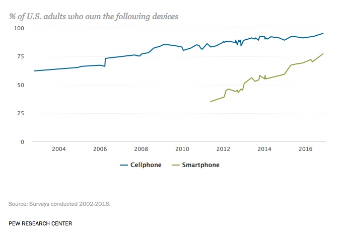

^ 23% of Americans still don't use a smartphone and those cost $20 new for the cheaper models.

^ The iPhone was debuted in early 2007. And it was then and still is an amazing invention and it took us over 10 years to get to 77% adoption.

^ Even if you invent a self driving car it will take a long time for the majority of Americans to be comfortable with them.

---

## 5) People Like People (Not Robots)

^ The First ATM came out in 1967. That's 50 years ago and they haven't replaced tellers in banks. And the vast majority of what a teller does can be automated by an ATM.

^ It's name is literally Automated Teller Machine.

---

## A.utomated
## T.eller
## M.achine

^ What might suprise you is that the number of tellers has actually grown between 2000 & 2010.

^ And I think that's because I hate when electronic things go wrong and there's no way to fix things. God forbid you have a Google product break there's no easy way to report a bug or even just ask support for help.

^ One of the amazing things about humans is we're so adaptable. We can switch from teller duty to customer support in a second. And if they're having some sort of problem we can take in all of the information and come up with a solution.

^ Whereas with a machine you might be completely stuck.

---

# Why Are We So Worried?

^ So why do we believe this? We have the numbers that says our economy is not going to be overrun with robots.

^ I think we believe all of the hype about automation because it seems true. And it's true-ish.

^ Here's the thing the US has lost a lot of jobs in the last 2 decades.

---

^ Two economists from MIT published a paper earlier this year about what happened to manufacturing jobs in the US.

## Job Losses

* Industrial Automation (since 1990): -670,000[^9]
* Trade with China (1999-2011): -2.4 million[^9]

^ talk about the numbers on the slide

^ When you break this down by year you can see that for every 1 job lost due to automation in the industrial sector we're losing 10 due to cheap trade from China.

[^9]: https://economics.mit.edu/files/12763

---

^ And here's what so disturbing about this. Donald Trump might accidentally be right about something. It's JINAs fault!

---

# What's Coming

^ My main message here isn't that automation is irrelevant. Because it is a factor.

^ Remember we're losing 10 times as many industrial jobs to China as we are to automation.

^ Automation is a factor but isn’t going to be disastrous as all of the articles tell us. So while most jobs are probably safe technology is constantly advancing and we still have to adapt to that technology and new circumstances.

---

Coast to coast self driving car by the end of 2017.[^10]

^ Elon Musk announced he'll have the first self driving car go coast to coast this year. It will start in LA and drive to New York.

^ So Self driving cars are coming. And that will affect the transportation sector. But remember they won't come all at once.

^ Even though automated elevators were better people preferred human elevator operators for years.

[^10]: http://blog.ted.com/what-will-the-future-look-like-elon-musk-speaks-at-ted2017/

---

# Who is brave?

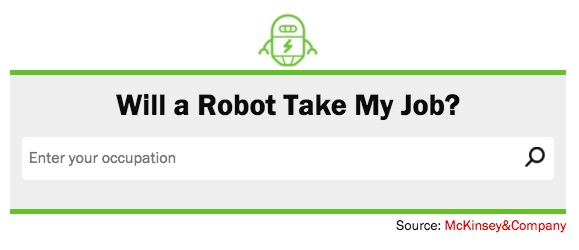

Find Out If a Robot Will Take Your Job

---

# Questions?

### Patrick Rauland - @BFTrick
