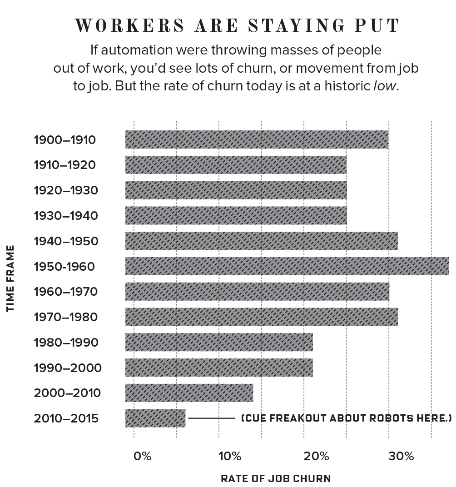

## Are Robots Coming to Take Your Job?

#### Patrick Rauland - @BFTrick

---

# Software Developer

^ I'm a software developer so I spend a lot of time thinking about automation. And part of that is because I do a lot of automation programming my self.

^ There's a lot of hype around automation. You see some really crazy headlines like:

---

Walmart replaces 4,000 workers with robots.[^1]

[^1]: https://www.theissue.com/politics/wal-mart-replaces-over-4000-workers-with-robots

^ Just last month Walmart replaced 4,000 workers with robots.

---

McDonalds replaces cashiers with kiosks in 2,500 restaurants[^2]

^ In June McDonalds replaced cashiers with kiosks in 2,500 restaurants. They look just like the airport kiosks.

[^2]: https://www.cnbc.com/2017/06/20/mcdonalds-hits-all-time-high-as-wall-street-cheers-replacement-of-cashiers-with-kiosks.html

---

Pepper helps retail stores.[^3]

^ This is Pepper. It's a humanoid robot that's been in a few pilot stores in San Francisco.

^ And the main purpose is to help people find things in store.

^  One store saw a 13% increase in revenue
^  Another saw a 6X increase in sales in their featured product.

[^3]: https://www.recode.net/2017/1/4/14171436/softbank-robot-pepper-sales-brick-and-mortar-retail-ces

^ To be fair when I go into best buy the last thing I want to do is talk to one of the sales representatives. I usually try to sneak in with out any of them asking me if I need any help. If I need help I'm surrounded by people in blue shirts. I'll be fine.

^ So maybe the robots are just less annoying?

^ Either way not having to pay employees hourly and seeing increases in revenue you can expect these to start showing up in the stores you visit.

^ Can read facial expressions so it knows if you're happy or sad.

^ It also can tell from the tone of your voice what emotional state you're in.

---

Farmer's Insurance dispatch drones for insurance claims[^4]

[^4]: https://www.farmers.com/news/2017/drone-program-takes-flight-at-farmers-insurance/

^ Farmer's Insurance announced two weeks ago that they're starting to dispatch drones to resolve any hail damage claims to your roof. And they said they're going to start in areas that have a lot of hail damange. So the next time you have hail damage to your roof and you submit a claim you may have a drone stop by instead of a human.

---

^ And this bot took my dream job away. T-rex pancake maker.

^ This is called PancakeBot. And you can get it on Amazon for $300. It prints anything you draw.

---

This cafeteria replaced all of their staff with self serve vending Machines[^5]

[^5]: http://www.recordonline.com/news/20170413/self-serve-kiosks-to-replace-food-staff-at-suny-orange

^ I feel so bad for the kids at that school.

---

^ And even academic literature paints a bleak future But a lot of them reference this study:

> According to our estimates, about 47 percent of total US employment is at risk. [^6]

[^6]: http://www.oxfordmartin.ox.ac.uk/downloads/academic/The_Future_of_Employment.pdf

^ this is one of the most cited studies which basically says you're fucked. Well 47% of us.

---

^ When you look at these headlines and you look at some of these academic studies the only logical conclusion is:

^ The robots are going to take our jobs and we're all going to die.

^ But I think when it comes to the academic studies there's an assumption.

---

### Assumption:

## If a job _can_ be automated it _will_

^ But I don't think this is true. Even though we have been automating jobs since computers became mainstream in the 70s & 80s we haven't really seen that big of an impact.

---

The Department of Labor tracks productivity in the US. And it's basically our GDP divided by the number of working people.

If automation were huge thing the productivity of US workers would soar right? Some jobs are automated and we'd get more out put out of less people.

---

But actually the opposite has happened. In the 1940s-1970s we were on average 3% more productive every year.

But since 2007 it's grown at a rate of 1.2 percent.

And the last two years it's been 0.6 percent.

^ https://www.wired.com/2017/08/robots-will-not-take-your-job/

---

Also you'd think if automation were happening on a grand scale we'd see a spike in unemployment. But we're below 5% which is healthy.

from: https://www.wired.com/2017/08/robots-will-not-take-your-job/

---

Or maybe you'd say that unemployment might not be low if people quickly find another job. But if you look at job churn it's the lowest it's been in decades

from: https://www.wired.com/2017/08/robots-will-not-take-your-job/

---

So even though we've been automating jobs with computers for the last 5 decades it hasn't had much of an effect.

---

# Why Automation Isn't Taking Off

---

## 1) No Investment

One reason we aren't moving faster towards robotics is that we aren't spending any money on it.

^ that small bar is what we invested in robotics here in the US. 11.3 billion dollars.

^ The larger bar is 15 billion dollars which is what we spend on sex toys. And don't get me wrong there are some really fun toys out there.

^ I made a slideshow of some of my favorites but my partner convinced me to take it out.

^ from: https://www.wired.com/2017/08/robots-will-not-take-your-job/

^ So seriously sex toys are great. But we're barely investing anything in automation. And at this current pace it will take us decades to perfect all of those things that automation says is right around the corner.

---

## 2) New & Better Jobs

^ There is another reason that we might not be seeing an impact on our economy. As jobs are eliminated new jobs are created or they're not eliminated and they're just changed.

---

^ Well let me tell you about what my job would have been in the 70s: accounting clerks and bookkeepers.

^ They were human excel spreadsheets. Businesses used to employ a team of accounting clerks to manage their spreadsheets. And this was before computers. So they were the size of board room tables. And you had to calculate every field by hand.

^ Businesses used to want to know if we decreased costs for this product by 5% what happens to our bottom line? And the accounting clerks would go into their nerd caves for days to redo a whole spreadsheet and then they'd product the results.

---

^ Then in 1979 VisiCalc was released for the Apple II computer. And it was the first computer spreadsheet. And I believe it was the top selling piece of software for the Apple II.

^ So from 1980 a year after VisiCalc was released until 1990 do you know what happened to those accounting clerk jobs?

^ Well technically we lost 400,000 jobs in that category.

---

^ But we gained 600,000 accounting jobs.

^ And that's because when we made it easy to update spreadsheets we started asking a lot more questions. Before computerized spreadsheets we might have only been able to ask 25 questions a year to our accounting clerks team

^ After the computerized spreadsheet we could ask hundreds or thousands of questions and create more advanced & accurate spreadsheets.

^ Many of those accounting clerks kept their jobs and just had to learn a new technology.

^ On paper their jobs were eliminated but another job super similar to their previous job was created.

---

## 3) Huge Costs

^ In addition to us not spending much money on this. To actually automate something complex it takes a lot of time, a lot of money, & an insanely smart team.

---

^ Everyone here knows a computer beat the world champion of chess. And that happened in 1996.

^ And you might have heard that a computer recently beat a human in Go.

---

^ Go is much more complex than chess in terms of the moves & positions. So it took a lot longer to solve this problem. In fact it took an entire company called DeepMind which was acquired by Google to solve just this one game.

^ The researchers had to create 3 separate neural networks that all used different strategies to win at Go. And then they had a main program that would pick the right strategy at the right time.

^ from: http://ludology.libsyn.com/gametek-classic-156-alpha-go

^ It took them a long time to figure this out but they eventually mastered it. And this is the perfect example of something that can be automated if there's enough time and money. It took an incredibly smart time years to beat humans at Go. And this was a board game created over 2,000 years old.

^ I actually do believe that 47% of our jobs could be automated if we have unlimited time & money.

---

## 4) Humans are Terrible with Change

^ Elevators used to actually kill people. You know how you run for an elevator? Well when we had elevator operators controlling the doors guess what happens if you reached for the door and they didn't see you?

^ Your hand would be crushed.

^ Some people tripped as they were running for the door. And they were crushed to death.

^ So the elevator industry created safer doors, and a buttons that anyone could use. But when those first elevators first came out people used to walk in and when they didn't see an operator they walked right out.

^ The elevator industry had to create ads convincing people that they were safer than humans.

^ It cost the elevator industry a lot of money to convince people to use a better product. Because we're stubborn. And that's just the way we are.

^ https://www.amazon.com/Ascending-Rooms-Express-Elevators-Passenger/dp/1886536465

---

## 5) People Like People (Not Robots)

The First ATM came out in 1967. That's 50 years ago and they haven't replaced tellers in banks.

In fact the number of tellers has actually grown between 2000 & 2010.

Department of Labor does predict that the number of tellers will decline by 8 percent over the next decade. But that’s 8 percent. That's relatively small considering how easily it could be automated.

From : https://www.wired.com/2017/08/robots-will-not-take-your-job/

---

# Why Are We So Worried?

^ So why do we believe this? We have the numbers that says our economy is not going to be overrun with robots.

^ I think we believe all of the hype about automation because it seems true. And it's true-ish.

^ Here's the thing we have lost a lot of jobs in the last 2 decades.

---

^ Two economists recently published a paper about what happened to manufacturing jobs in the US.

* Industrial Automation (since 1990): -670,000
* Trade with China (1999-2011): -2.4 million

---

"We’ve been running massive trade deficits, driven mainly by manufacturing, and we’ve seen a precipitous plunge in the number of manufacturing jobs. To say those two things aren’t correlated is nuts."
- Dean Baker

^ And here's what so disturbing at that statement. Donald Trump might accidentally be right about something. It's GINAs fault!

^ from: https://www.wired.com/2017/08/robots-will-not-take-your-job/

---

# Where Do We Go From Here?

^ So automation could be amazing but we're not moving as quickly as we could. What's next?

---

Elon Musk announced he'll have the first self driving car go coast to coast this year. It will start in LA and drive to New York.

So Self driving cars are coming. And that will affect the transportation sector. But remember they won't come all at once.

Even though automated elevators were better people preferred human elevator operators for years.

---

# Taxes

Bill Gates says robots should be taxed.[^20]

^ We actually do need to think about how taxing robots. Right now a human who works for $50,000 a year generates a lot of tax revenue for the government. Robots don't. As humans start dropping out of the work force we have to make up that tax income somehow.

^ Bill Gates suggests a robot tax and some countries have started to look into this. But I would rather find taxes revenue from other places.

[^20]: https://qz.com/911968/bill-gates-the-robot-that-takes-your-job-should-pay-taxes/

---

# Universal Basic income

^ We need to start thinking about a universal basic income. Right now our economy is designed around everyone being a consumer. If people don't work how will they consume?

^ We need a way to redistribute wealth to people who can't find a job.

^ During the great depression unemployment his 25%. And we're at 5% right now. So if we automate 20% of the jobs our there. We could have serious problems. So figuring out a universal basic income is really important.

---

# Who is brave?

Find Out If a Robot Will Take Your Job

---

# Further

Humans Need Not Apply: https://youtu.be/7Pq-S557XQU

The Rise of the Machines – Why Automation is Different this Time: https://youtu.be/WSKi8HfcxEk

The Rise of the Robots: http://a.co/3LeR3UW

The Second Machine Age: http://a.co/fpaaGkh

---

# Questions?

### Patrick Rauland - @BFTrick

---

Major innovations

- Fire (warmth & purifying water) - Millions of years ago
- Wheel & Axel - 3,500 BC
- Paper - 100
- Compass - ~1,000
- Printing Press - 1440
- Refrigeration -
- Plumbing - 1829 (the first hotel had indoor plumbing)
- Internal Combustion Engine (cars, planes, trains) - 1859
- Telephone (communicating everyone) - 1876
- Electricity (light! computers, refrigeratorsm power) - 1879
- Penicillin (the first anti-biotic) - 1928
- Computer - 1832 (1971 when the first personal computer was sold)
- Internet (shopping, communications, relationships, etc) - 1989

---

It's natural for human to want to improve their tools.

Show graph of the percent of US population in agriculture

After we optimized agriculture - we started improving other things (ex construction machines)

Everytime we created a better tool we became more productive. Meaning we could make more with the same amount of effort. And that free's a chunk of the population to do new better things.

And decades of improving tools for physical labor we started to improve tools for mental labor (ex. Excel). In the 70s big companies used to have teams of people who managed their spreadsheets. And it tooks days to tweak one thing in the spreadsheet and see how it affected the rest of the sheet.

---

In 1979 GM employed 800,000s of employees. And made 11 billion dollars.

Google employed 58,000 & made 14 billion dollars

From: https://www.youtube.com/watch?v=WSKi8HfcxEk

---

What about the internet?

It did create new industries. But it's not replacing as many jobs.

In 2004 Blockbuster employed 84,000 employees and made 6 billion

In Netflix had 4,500 employees and made 9 billion in revenue

From: https://www.youtube.com/watch?v=WSKi8HfcxEk

---

US Job Creation since 1970 has been going down.

From: https://www.youtube.com/watch?v=WSKi8HfcxEk

- In 1998 Humans worked 194 billion hours

- Over the next 15 years output increased by 42%

- But in 2013 we're still working 194 billion hours.

---

What used to be 30 cashiers is now 1 human overseeing 30 robots

---

Automation today isn't about teaching a bot one specific thing or a specific job.

It's about creating a bot that can monitor how it should work and then it teaches it self.

---

Won't unions or labor laws help us?

- No! That's where the term luddite came from.

---

Doesn't automation eliminate jobs we don't want to have anyway?

- Automation is best at removing

---

Things that bots are good at:

- Paperwork
- Decision making
- Writing
